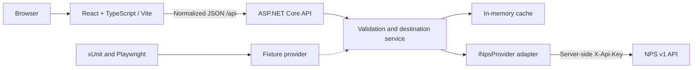

# CainCraft Outdoor Explorer

An independent destination explorer for **National Park Service properties in Idaho, Oregon, and Washington**. Start with a state and activity, browse matching destinations, open a park, and consult its official NPS page and provider-reported alerts before planning a visit.

**Status:** NPS parks backend (#41), searchable destination list/detail UI (#42), deterministic tests (#43), optional map/proximity filters (#44), independent NPS alerts/road events (#45), and park-level campgrounds (#46) are implemented. Search supports multiple states, keywords, catalog-derived activities, shareable URLs, credited approved photos, and operating information. API and Chromium browser coverage uses synthetic NPS fixtures and map tiles without credentials or live provider traffic.

## Scope

The MVP supports one or more states (`ID`, `OR`, `WA`), text search, NPS activity filters, destination details, credited photos where permitted, operating information where supplied, and alerts with source and freshness information. “Park” includes NPS designations such as monuments and historic sites, not only national parks. Include a multi-state property when any of its states matches; retain its full state list and deduplicate by NPS park code.

NPS is the source for its own properties, not a complete outdoor inventory. The MVP excludes state parks, Forest Service/BLM inventory, reservations, live campsite availability, crowd/solitude predictions, routing, weather, accounts, and saved trips. An activity listing does not establish current access. Missing alerts do not mean safe travel or open roads. Coordinates describe a property, not a verified entrance or navigable destination.

Drive times, additional providers, and saved trips are separately scoped follow-ons. Basic accessibility is part of the MVP, not deferred to later hardening.

## Architecture and boundaries



The frontend owns controls, URL filter state, rendering, navigation, and accessible loading/error messages. The backend owns validation, provider credentials, pagination, normalization, filtering, caching, and failures. Only the NPS adapter understands raw NPS DTOs. Production uses the real provider; deterministic tests inject fixtures at that same backend boundary. Browser tests exercise the actual app API.

Use **xUnit** for backend unit and API integration tests, **Vitest** for frontend component tests, and **Playwright TypeScript** for browser tests. The frontend uses lightweight React without a full-stack framework; no database is needed initially. Runtime and dependency versions are pinned locally. Do not use the repository-root Node packages, Jekyll, Liquid, Circadia assets, OAuth worker, or Trailbreaker Recon.

The frontend may later be statically hosted on caincraft.com or a subdomain; ASP.NET Core needs its own runtime host. Hosting, base paths, SPA fallback, exact CORS origins, and DNS integration are decisions for #49. No deployment or domain changes are part of this issue.

### Structure

API, frontend, provider fixtures, and the Playwright suite are implemented. A separate `tests/OutdoorExplorer.E2eHost/` executable boots the actual API with fixture HTTP transport.

```text
projects/outdoor-explorer/
  README.md
  .gitignore                   # local secrets, build output, test artifacts
  .env.example                 # names/placeholders only
  global.json                  # pinned SDK
  OutdoorExplorer.slnx
  src/
    OutdoorExplorer.Api/       # endpoints, services, contracts, NPS adapter
    web/                      # React/TypeScript/Vite; own package.json + lockfile
  tests/
    OutdoorExplorer.E2eHost/   # test-only Kestrel host with fixture HTTP transport
    OutdoorExplorer.Api.Tests/ # xUnit unit + WebApplicationFactory tests
    e2e/                      # Playwright TS; own package.json + lockfile
    fixtures/nps/             # sanitized representative provider payloads
  scripts/                    # project-local build/test orchestration
  docs/
    contracts.md
    adr/
      0001-independent-app.md
      0002-provider-and-data-policy.md
      0003-testing-and-release.md
```

See [normalized contracts and operational policy](docs/contracts.md) and the [architecture decisions](docs/adr/0001-independent-app.md).

## Local development and checks

Use **.NET SDK 10.0.401** (pinned in `global.json`, targeting .NET 10) and **Node 24.15.0** (pinned in `.nvmrc`; npm 8.19.1 or newer). Package versions and transitive dependencies are locked independently in NuGet `packages.lock.json` files and independent frontend/E2E `package-lock.json` files. The SDK is available from the [.NET 10 download page](https://dotnet.microsoft.com/en-us/download/dotnet/10.0); the Node version meets [Vite's runtime requirements](https://vite.dev/guide/).

Run from `projects/outdoor-explorer/`:

```powershell
dotnet restore OutdoorExplorer.slnx --locked-mode
npm --prefix src/web ci

# Terminal 1: API at http://localhost:5080 (Development launch profile)
dotnet run --project src/OutdoorExplorer.Api

# Terminal 2: frontend at http://localhost:5173
npm --prefix src/web run dev
```

Open **http://localhost:5173**. Destination search requires the API with `NPS_API_KEY` configured as described below; automated tests need no key or network. `/health` remains a key-free process check. Stop the API and reload to see the unavailable state; restart it and select **Retry destinations** to recover. Browser park requests time out after 40 seconds, allowing the backend its 30-second provider budget.

Configuration is checked in for local use: the API launch profile binds port 5080, Development configuration allows exactly `http://localhost:5173`, and Vite binds localhost on port 5173 with strict-port behavior. Production has no allowed CORS origins by default. CORS is a browser policy, not authentication. Changing ports requires updating these settings and the public API URL together.

The frontend's optional `src/web/.env.local` may contain **only public configuration**, following `src/web/.env.example`. Vite disables automatic `VITE_*` exposure and explicitly injects only `VITE_API_BASE_URL`. Never place secrets in frontend files, public assets, or source code. Store provider credentials outside the repository in a host secret manager or backend process environment. The root `.env.example` is a reference, not an automatically loaded configuration file.

### NPS parks API

For repeated local use, the API supports .NET User Secrets in Development. From the repository root, run this in PowerShell 7 and enter the key at the masked prompt:

```powershell
$npsKey = Read-Host 'NPS API key' -MaskInput
@{ NPS_API_KEY = $npsKey } | ConvertTo-Json -Compress | dotnet user-secrets set --project projects/outdoor-explorer/src/OutdoorExplorer.Api
Remove-Variable npsKey
```

Restart the API after saving. User Secrets are stored outside the repository under your Windows user profile and automatically loaded by the Development launch profile. They are not encrypted and are intended for local development only. An existing `NPS_API_KEY` environment variable takes precedence. Production should use the host's secret manager or backend environment.

Obtain a personal key through the [NPS signup](https://www.nps.gov/subjects/developer/get-started.htm) out of band. Configure `NPS_API_KEY` in the backend process environment or have the host secret manager inject it. Do not paste keys into source, frontend configuration, terminal commands saved in history, or issue comments. The API always uses NPS; automated tests replace its provider or HTTP transport through dependency injection. There is no runtime fixture mode or `Nps:ApiKey` fallback.

After starting the API, request:

```text
http://localhost:5080/api/parks?states=ID,OR,WA
http://localhost:5080/api/parks/crla
http://localhost:5080/api/parks?states=OR&q=lake&activityId=B33DC9B6-0B7D-4322-BAD7-A13A34C584A3
```

Responses include `data`, `status`, `retrievedAt`, and stable warning codes. A missing key returns safe 503 Problem Details on park routes; `/health` continues to work. Empty successful searches return 200 with `data: []`. Invalid filters/codes return 400. A well-formed code absent from the complete regional catalog returns 404; absence from a partial catalog returns 503.

All filters and detail requests share one ID/OR/WA catalog cached in memory for 60 minutes. Concurrent misses share one fetch. A failed or incomplete refresh never overwrites a complete catalog: it can be served as `stale` until 24 hours after retrieval. Without that fallback, usable incomplete data is `partial`; no usable data returns 503. Failed/partial refreshes have a 30-second cooldown. Restarting the process clears the cache. Each process allows 120 park requests per minute; excess requests get 429 Problem Details. This MVP limiter is global, not per user, and distributed hosting needs shared quota coordination.

The adapter sends the key only in `X-Api-Key`, disables redirects and default HTTP logging, and uses a fixed official NPS API origin. It fetches all `limit=50` pages with state filters and validates page offsets/totals; duplicates are removed by park code. Attempts time out after 10 seconds with a 30-second overall fetch budget. Network/5xx/timeouts receive at most two retries with jitter; 401/403 are not retried. Upstream 429 honors `Retry-After` (five-second increasing fallback). Waits beyond the budget become unavailable/stale responses. Only numeric status/quota metadata is logged, never credentials or upstream bodies.

Invalid coordinate pairs become `null`; multi-state parks keep every reported state. Official links must use HTTP(S) on `nps.gov` or its subdomains. Photos retain credit, caption, alt text, and source, but only exact URLs in `Nps__ApprovedPhotoUrls__0` (and subsequent indices) are returned after a human has reviewed reuse rights. The default allowlist is empty. No image rights are inferred from an NPS credit or host.

Default tests need no key or network. An optional live smoke test is skipped unless `NPS_LIVE_SMOKE=1`; with a key already securely configured in the environment, run:

```powershell
$env:NPS_LIVE_SMOKE = '1'
dotnet test OutdoorExplorer.slnx --filter 'Category=Live'
Remove-Item Env:NPS_LIVE_SMOKE
```

It checks the real normalized regional catalog, including Crater Lake, and never records payloads or credentials. Endpoint/detail behavior is covered by offline integration tests. See [fixture provenance](tests/fixtures/nps/README.md) and [API contracts](docs/contracts.md).

Run all checks with PowerShell 7:

```powershell
pwsh -File scripts/check.ps1
```

Or run the individual cross-platform commands:

```powershell
dotnet build OutdoorExplorer.slnx --no-restore
dotnet format OutdoorExplorer.slnx --no-restore --verify-no-changes
dotnet test OutdoorExplorer.slnx --no-build --filter 'Category!=Live'
npm --prefix src/web run lint
npm --prefix src/web test
npm --prefix src/web run build
```

### Deterministic API and browser tests

After installing the pinned SDK and Node, run this one-time dependency/browser setup from this project directory (downloads require network):

```powershell
npm --prefix src/web ci
npm --prefix tests/e2e ci
npm --prefix tests/e2e run install:browsers
```

One command restores/builds the backend and runs offline API tests plus Chromium E2E:

```powershell
npm --prefix tests/e2e run test:all
```

The test command explicitly excludes live-NPS tests, needs no real NPS key, and starts/stops both services on dedicated loopback ports 5088/5178. Tests never reuse an existing server. Dependency restoration may need network on a fresh machine; test data and app requests need none. `scripts/check.ps1` also runs E2E type/format checks and browser tests alongside the existing build/lint/component checks.

Failure traces, screenshots, and video are retained under `tests/e2e/test-results/`; the HTML report lives under `tests/e2e/playwright-report/`. These directories are ignored by Git. See [test conventions](tests/e2e/README.md) for diagnostics, optional browsers, and the separate live-smoke path. CI upload/retention and scheduling remain scoped to #48.

### Contributor notes

Keep changes under this project except the explicit Jekyll publishing exclusion. Use `dotnet format OutdoorExplorer.slnx --no-restore` and `npm --prefix src/web run format` before review. Add API integration coverage for endpoints and component coverage for visible loading, failure, and recovery behavior. Tests use no external provider and require no credentials. Run the quality checks above before submitting changes; commit updated lockfiles with intentional dependency changes.

Errors use Problem Details (`application/problem+json`) with `type`, `title`, `status`, safe `detail`, and `traceId`. Exceptions use the same sanitized response in Development and Production; route misses also follow this convention. Health reports process availability only, not NPS availability.

The suite covers API health, CORS, safe failures, pagination, normalization, wire contracts, input validation, cache behavior, quotas and retries, frontend states, and browser search/detail journeys. See [test conventions and diagnostics](tests/e2e/README.md).

### Configuration contract

| Variable | Owner | Value/behavior |
| --- | --- | --- |
| `NPS_API_KEY` | Backend secret | Required for park fetches; never returned or logged |
| `Nps__ParksCacheMinutes` | Backend | `60`; integer 1–1440, with a 24-hour total stale age limit |
| `Nps__AttemptTimeout` | Backend | `00:00:10`; positive, at most 10 seconds |
| `Nps__RequestBudget` | Backend | `00:00:30`; positive, at most 30 seconds |
| `Nps__ApprovedPhotoUrls__0` | Backend | Exact reviewed photo URL; empty allowlist by default |
| `AllowedOrigins__0` | Backend | `http://localhost:5173` in development; exact staging origin later |
| `VITE_API_BASE_URL` | Public frontend build config | `http://localhost:5080`; never a secret |

Keep production keys in the host's secret manager and inject them as `NPS_API_KEY`. Commit only placeholders. Ignore local `.env*` (except examples), local secret files, `.NET bin/obj`, `node_modules`, `dist`, Playwright artifacts, and logs within the project. Redact credentials from diagnostics and fixture recordings; rotate any accidentally exposed key. Never use a `VITE_` variable for a provider key because frontend configuration is public.

## Attribution, content, and accessibility

Display “Data: National Park Service” linked to the official park page and describe CainCraft as an independent app. Retain source links and timestamps. NPS content can include third-party material: preserve image credit, caption, and alt text; verify reuse rights before displaying an image, and omit uncertain images with a stable text fallback. Attribution alone does not establish permission. Do not use the NPS Arrowhead or imply endorsement. Review the [NPS disclaimer](https://www.nps.gov/aboutus/disclaimer.htm) before release, including applicable notices for commercial reuse.

Use semantic headings, explicit filter labels, keyboard-operable controls, visible focus, readable contrast, reduced-motion support, and responsive layouts. Announce result/loading/error changes without repeatedly moving focus; set an appropriate focus target on route navigation. Keep source links understandable out of context. Missing images and optional fields must preserve usable layout. Automated checks accompany manual keyboard, zoom, mobile, and screen-reader review; a later map must retain an equivalent list.

## Ordered milestones and release gates

This is implementation order, which intentionally brings CI and alerts forward ahead of optional map work. Each issue adds its own fixture tests; #43 expands and standardizes coverage.

| Order | Issue | Deliverable / gate |
| --- | --- | --- |
| 0 | [#39 Blueprint](https://github.com/jason-caincraft/circadia.github.io/issues/39) | Scope, contracts, ADRs; documentation only |
| 1 | [#40 Scaffold](https://github.com/jason-caincraft/circadia.github.io/issues/40) | Pinned tools, isolated app, `/health`, visible service-down state; runnable commands |
| 2 | [#41 NPS parks](https://github.com/jason-caincraft/circadia.github.io/issues/41) | Validated normalized parks, pagination, cache, fixture coverage |
| 3 | [#42 Destination UI](https://github.com/jason-caincraft/circadia.github.io/issues/42) | State/activity/text filters, shareable URLs, responsive details |
| 4 | [#43 Test suite](https://github.com/jason-caincraft/circadia.github.io/issues/43) | Deterministic API + Chromium E2E with failure diagnostics |
| 5 | [#48 CI](https://github.com/jason-caincraft/circadia.github.io/issues/48) | Clean-checkout build/lint/test without provider secrets |
| 6 | [#45 Alerts and road events](https://github.com/jason-caincraft/circadia.github.io/issues/45) | Complete core journey; verify endpoint contracts and distinguish empty/unavailable |
| 7 | [#49 Staging](https://github.com/jason-caincraft/circadia.github.io/issues/49) | MVP release: CI green, accessibility/source review, smoke tests, rollback documented |
| 8 | [#44 Map](https://github.com/jason-caincraft/circadia.github.io/issues/44) | Optional enhancement; attribution and accessible fallback |
| 9 | [#46 Campgrounds](https://github.com/jason-caincraft/circadia.github.io/issues/46) | Inventory/amenities, never implied booking availability |
| 10 | [#47 Drive distance](https://github.com/jason-caincraft/circadia.github.io/issues/47) | After map; separate routing provider evaluation |
| 11 | [#50 RIDB](https://github.com/jason-caincraft/circadia.github.io/issues/50) | After stable MVP; retain provider provenance |
| 12 | [#51 Conditions](https://github.com/jason-caincraft/circadia.github.io/issues/51) | After deployed MVP; independently sourced conditions |
| 13 | [#52 Saved trips and hardening](https://github.com/jason-caincraft/circadia.github.io/issues/52) | Local-only persistence first; deeper accessibility/performance review |

The root Jekyll configuration excludes only `projects/outdoor-explorer` from publication. This prevents app source, dependencies, local configuration, and build artifacts from being copied into Circadia. Existing site routes and root Node dependencies are unchanged. Verify this boundary with a Jekyll build to a temporary destination; it must contain the existing archive route and no `projects/outdoor-explorer` directory. Never store secrets in the site tree, even in ignored files.

## References

Provider guidance checked for this blueprint on 2026-09-26; recheck contracts and terms during integration and release:

- [NPS API documentation](https://www.nps.gov/subjects/developer/api-documentation.htm)
- [NPS authentication and rate limits](https://home.nps.gov/subjects/developer/guides.htm)
- [NPS content and image disclaimer](https://www.nps.gov/aboutus/disclaimer.htm)

### Destination browser

Choose one or more states, an optional keyword (up to 200 characters), and an activity, then select **Search destinations**. Filters are applied by the API. Activity options come from a separate unfiltered regional catalog request, so narrowing a search does not remove choices. Stale or partial catalog data is labeled. Empty results, unavailable data, and missing destinations have distinct messages.

The query parameters `states`, `q`, and `activityId` preserve the submitted search; `park` opens a destination detail view. For example, `?states=OR,WA&q=lake` and `?states=OR&park=crla` are shareable links. Back to destinations preserves filters, and browser Back/Forward restores URL state. Invalid recognized parameters (including duplicates) show a recoverable message; unknown parameters are ignored. Clearing every state disables submission.

Photos use only the API's reviewed allowlist, with supplied credits and source links. Missing or failed photos have a fixed-aspect placeholder. Missing descriptions, activities, and operating information are labeled. Provider strings are rendered as text. NPS attribution follows the [NPS disclaimer](https://www.nps.gov/aboutus/disclaimer.htm), reviewed 2026-09-27; no NPS marks are used.

### Optional park map and proximity

Select **Show map** to load Leaflet 1.9.4 and OpenStreetMap standard raster tiles. The destination list always remains available. Markers use the same submitted state, keyword, activity, and optional proximity filters as the list. Bounds fit valid points; a single point is capped at zoom 10. Missing or invalid coordinate pairs are labeled in the list and omitted from the map. Multi-state properties retain every reported state and have one marker at their NPS property coordinate, even when that point lies outside a selected state. Coordinates are approximate property locations, not verified entrances or navigation targets. Keyboard-operable markers open popups linking to destination detail while retaining search filters.

The map needs no provider token. Attribution remains visible on and below the map. Opening it sends the viewed map area, browser IP address, and origin Referer to OpenStreetMap. Tiles use the exact HTTPS endpoint, a browser User-Agent, an origin Referer, and normal browser caching; there is no prefetch, bulk download, offline tile cache, or proxy. Only tiles for the displayed viewport are requested. The [OSMF tile usage policy](https://operations.osmfoundation.org/policies/tiles/), [terms of use](https://wiki.osmfoundation.org/wiki/Terms_of_Use), and [privacy policy](https://wiki.osmfoundation.org/wiki/Privacy_Policy) apply. Tile policy reviewed 2026-09-28. Service is best-effort and may be blocked or withdrawn; reassess provider capacity and policies before release or increased traffic. Failed tiles leave markers and the list usable; a map-library load failure shows a list fallback. Hide and reopen the map to retry.

Select **Use my location** to request browser permission; location is never requested automatically. A successful request enables an approximate radius (50–1000 km) applied locally to the API-filtered destinations. Distance is straight-line great-circle distance to the supplied property point, not driving distance or distance to an entrance. Destinations without valid coordinates are excluded only while proximity is active, with an explicit count. Denied, unavailable, or timed-out location leaves other filters usable. Location remains in memory through search/detail navigation, is not sent to the API, saved to storage, or included in shared URLs, and is cleared by reload, **Clear location filter**, or **Reset filters**. Browser location requires a secure context (HTTPS or localhost). City geocoding is not used.

### Visitor alerts and road events

Park details load separate visitor-alert and road-event feeds through the backend. Each feed shows NPS attribution, retrieval time, provider index/source update dates where supplied, and official source links. Successful empty responses say that NPS returned no records. Unavailable feeds retain the destination details and offer independent retry buttons. NPS data may be delayed or incomplete; missing records do not mean safe travel or open roads. Consult the linked official park source before visiting.

### Campgrounds

Park details load NPS `/campgrounds` independently through `/api/parks/{parkCode}/campgrounds`. The API validates all upstream pages and park membership, normalizes physical location, site inventory, supplied fees, reservation information, and documented amenities, then caches a complete result for five minutes. Missing fields are labeled; invalid or incomplete feeds are unavailable with a retry option. Filters select only campgrounds with positive NPS site counts or affirmative amenity values. Campground counts are inventory, not real-time availability, and primitive classification says nothing about crowd levels. Booking links appear only for valid HTTPS URLs supplied by NPS. The park page remains available if this feed fails.

Backend routes are `/api/parks/{parkCode}/alerts` and `/api/parks/{parkCode}/road-events`. Complete feeds, including empty results, are cached for five minutes, compared with 60 minutes for park metadata. Failures use a 30-second cooldown and never reuse expired feed data. Road-event source organization must match the catalog park name because the published GeoJSON contract has no feature park-code field; unverifiable membership is shown as unavailable. See [verified contracts](docs/contracts.md) for endpoint fields and limitations.
