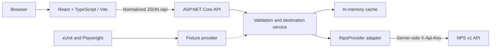

# CainCraft Outdoor Explorer

An independent destination explorer for **National Park Service properties in Idaho, Oregon, and Washington**. Start with a state and activity, browse matching destinations, open a park, and consult its official NPS page and provider-reported alerts before planning a visit.

**Status:** blueprint for [#39](https://github.com/jason-caincraft/circadia.github.io/issues/39). This directory contains documentation only; the commands and source tree below are implementation targets, not an existing runnable application. Scaffolding begins in #40.

## Scope

The MVP supports one or more states (`ID`, `OR`, `WA`), text search, NPS activity filters, destination details, credited photos where permitted, operating information where supplied, and alerts with source and freshness information. “Park” includes NPS designations such as monuments and historic sites, not only national parks. Include a multi-state property when any of its states matches; retain its full state list and deduplicate by NPS park code.

NPS is the source for its own properties, not a complete outdoor inventory. The MVP excludes state parks, Forest Service/BLM inventory, reservations, live campsite availability, crowd/solitude predictions, routing, weather, accounts, and saved trips. An activity listing does not establish current access. Missing alerts do not mean safe travel or open roads. Coordinates describe a property, not a verified entrance or navigable destination.

Maps, campgrounds, drive times, additional providers, and saved trips are separately scoped follow-ons. Basic accessibility is part of the MVP, not deferred to later hardening.

## Architecture and boundaries



The frontend owns controls, URL filter state, rendering, navigation, and accessible loading/error messages. The backend owns validation, provider credentials, pagination, normalization, filtering, caching, and failures. Only the NPS adapter understands raw NPS DTOs. Production uses the real provider; deterministic tests inject fixtures at that same backend boundary. Browser tests exercise the actual app API.

Choose **xUnit** for backend unit and API integration tests and **Playwright TypeScript** for browser tests. Use lightweight React without a full-stack framework; no database is needed initially. Pin supported .NET SDK, Node, and package versions in #40, including `global.json`, a Node version file, and an independent lockfile. Do not use the repository-root Node packages, Jekyll, Liquid, Circadia assets, OAuth worker, or Trailbreaker Recon.

The frontend may later be statically hosted on caincraft.com or a subdomain; ASP.NET Core needs its own runtime host. Hosting, base paths, SPA fallback, exact CORS origins, and DNS integration are decisions for #49. No deployment or domain changes are part of this issue.

### Proposed structure

Only this README and `docs/` exist in the blueprint; other entries are targets for follow-on work.

```text
projects/outdoor-explorer/
  README.md
  .gitignore                   # local secrets, build output, test artifacts
  .env.example                 # names/placeholders only
  global.json                  # pinned SDK
  OutdoorExplorer.sln
  src/
    OutdoorExplorer.Api/       # endpoints, services, contracts, NPS adapter
    web/                      # React/TypeScript/Vite; own package.json + lockfile
  tests/
    OutdoorExplorer.Api.Tests/ # xUnit unit + WebApplicationFactory tests
    e2e/                      # Playwright TS; own package.json + lockfile
    fixtures/nps/             # sanitized representative provider payloads
  scripts/                    # project-local build/test orchestration
  docs/
    contracts.md
    adr/
      0001-independent-app.md
      0002-provider-and-data-policy.md
      0003-testing-and-release.md
```

See [normalized contracts and operational policy](docs/contracts.md) and the [architecture decisions](docs/adr/0001-independent-app.md).

## Local development and tests: target workflow

**These commands become usable after #40; the full test suite arrives in #43.** Run from this directory, using the runtime versions pinned by #40. The scaffold must implement and verify these commands from a clean checkout, or update this section with its actual commands.

```powershell
dotnet restore OutdoorExplorer.sln
npm --prefix src/web ci
npm --prefix tests/e2e ci
npm --prefix tests/e2e exec -- playwright install chromium

# Terminal 1: deterministic development with no NPS key or external API calls
$env:ASPNETCORE_ENVIRONMENT = "Development"
$env:OutdoorExplorer__Provider = "Fixture"
dotnet run --project src/OutdoorExplorer.Api -- --urls http://localhost:5080

# Terminal 2: frontend at http://localhost:5173
npm --prefix src/web run dev -- --host localhost --port 5173 --strictPort
```

Live development switches `OutdoorExplorer__Provider` to `Nps` and supplies `NPS_API_KEY` through a local secret store/environment. Do not paste keys into tracked files or commands saved in shell history. The app must explicitly map that variable to the provider options; environment variables do not automatically load from `.env` in ASP.NET Core.

Target quality commands:

```powershell
dotnet build OutdoorExplorer.sln --no-restore
dotnet format OutdoorExplorer.sln --verify-no-changes
dotnet test OutdoorExplorer.sln --no-build
npm --prefix src/web run lint
npm --prefix src/web run test -- --run
npm --prefix src/web run build
npm --prefix tests/e2e test
```

The E2E command must start/stop isolated backend and frontend servers via Playwright `webServer` configuration with the fixture provider and known ports. Stop manually started services first; CI must not reuse an unknown server. #43 must also supply a project-local aggregate command for API and E2E tests. Live provider smoke checks are opt-in and separate from normal tests.

### Configuration contract

| Variable | Owner | Planned value/behavior |
| --- | --- | --- |
| `NPS_API_KEY` | Backend secret | Required only in `Nps` mode; never returned or logged |
| `OutdoorExplorer__Provider` | Backend | `Nps` by default; `Fixture` only in Development/Test |
| `Nps__BaseUrl` | Backend | `https://developer.nps.gov/api/v1/`; not client-controlled |
| `Nps__ParksCacheMinutes` | Backend | `60`, proposed policy |
| `Nps__AlertsCacheMinutes` | Backend | `5`, proposed policy |
| `AllowedOrigins__0` | Backend | `http://localhost:5173` in development; exact staging origin later |
| `VITE_API_BASE_URL` | Public frontend build config | `http://localhost:5080`; never a secret |

Keep production keys in the host's secret manager. Use .NET user secrets for local storage if the scaffold adds an explicit `Nps:ApiKey` fallback, with `NPS_API_KEY` taking precedence. Commit only placeholders. Ignore local `.env*` (except examples), local secret files, `.NET bin/obj`, `node_modules`, `dist`, Playwright artifacts, and logs within the project. Redact credentials from diagnostics and fixture recordings; rotate any accidentally exposed key. Never use a `VITE_` variable for a provider key because frontend configuration is public.

## Attribution, content, and accessibility

Display “Data: National Park Service” linked to the official park page and describe CainCraft as an independent app. Retain source links and timestamps. NPS content can include third-party material: preserve image credit, caption, and alt text; verify reuse rights before displaying an image, and omit uncertain images with a stable text fallback. Attribution alone does not establish permission. Do not use the NPS Arrowhead or imply endorsement. Review the [NPS disclaimer](https://www.nps.gov/aboutus/disclaimer.htm) before release, including applicable notices for commercial reuse.

Use semantic headings, explicit filter labels, keyboard-operable controls, visible focus, readable contrast, reduced-motion support, and responsive layouts. Announce result/loading/error changes without repeatedly moving focus; set an appropriate focus target on route navigation. Keep source links understandable out of context. Missing images and optional fields must preserve usable layout. Automated checks accompany manual keyboard, zoom, mobile, and screen-reader review; a later map must retain an equivalent list.

## Ordered milestones and release gates

This is implementation order, which intentionally brings CI and alerts forward ahead of optional map work. Each issue adds its own fixture tests; #43 expands and standardizes coverage.

| Order | Issue | Deliverable / gate |
| --- | --- | --- |
| 0 | [#39 Blueprint](https://github.com/jason-caincraft/circadia.github.io/issues/39) | Scope, contracts, ADRs; documentation only |
| 1 | [#40 Scaffold](https://github.com/jason-caincraft/circadia.github.io/issues/40) | Pinned tools, isolated app, `/health`, visible service-down state; runnable commands |
| 2 | [#41 NPS parks](https://github.com/jason-caincraft/circadia.github.io/issues/41) | Validated normalized parks, pagination, cache, fixture coverage |
| 3 | [#42 Destination UI](https://github.com/jason-caincraft/circadia.github.io/issues/42) | State/activity/text filters, shareable URLs, responsive details |
| 4 | [#43 Test suite](https://github.com/jason-caincraft/circadia.github.io/issues/43) | Deterministic API + Chromium E2E with failure diagnostics |
| 5 | [#48 CI](https://github.com/jason-caincraft/circadia.github.io/issues/48) | Clean-checkout build/lint/test without provider secrets |
| 6 | [#45 Alerts and road events](https://github.com/jason-caincraft/circadia.github.io/issues/45) | Complete core journey; verify endpoint contracts and distinguish empty/unavailable |
| 7 | [#49 Staging](https://github.com/jason-caincraft/circadia.github.io/issues/49) | MVP release: CI green, accessibility/source review, smoke tests, rollback documented |
| 8 | [#44 Map](https://github.com/jason-caincraft/circadia.github.io/issues/44) | Optional enhancement; attribution and accessible fallback |
| 9 | [#46 Campgrounds](https://github.com/jason-caincraft/circadia.github.io/issues/46) | Inventory/amenities, never implied booking availability |
| 10 | [#47 Drive distance](https://github.com/jason-caincraft/circadia.github.io/issues/47) | After map; separate routing provider evaluation |
| 11 | [#50 RIDB](https://github.com/jason-caincraft/circadia.github.io/issues/50) | After stable MVP; retain provider provenance |
| 12 | [#51 Conditions](https://github.com/jason-caincraft/circadia.github.io/issues/51) | After deployed MVP; independently sourced conditions |
| 13 | [#52 Saved trips and hardening](https://github.com/jason-caincraft/circadia.github.io/issues/52) | Local-only persistence first; deeper accessibility/performance review |

Before #40 ships to the publishing branch, resolve Jekyll artifact isolation: the current root `_config.yml` does not exclude `projects/`. A project-local `.gitignore` does not prevent Jekyll from copying tracked source. Arrange a separately scoped publishing exclusion or equivalent artifact boundary and verify generated-site contents before introducing runnable source/configuration. This blueprint changes no existing site configuration; its public documentation is safe to copy. Never store secrets in the site tree, even in ignored files.

## References

Provider guidance checked for this blueprint on 2026-09-26; recheck contracts and terms during integration and release:

- [NPS API documentation](https://www.nps.gov/subjects/developer/api-documentation.htm)
- [NPS authentication and rate limits](https://home.nps.gov/subjects/developer/guides.htm)
- [NPS content and image disclaimer](https://www.nps.gov/aboutus/disclaimer.htm)
